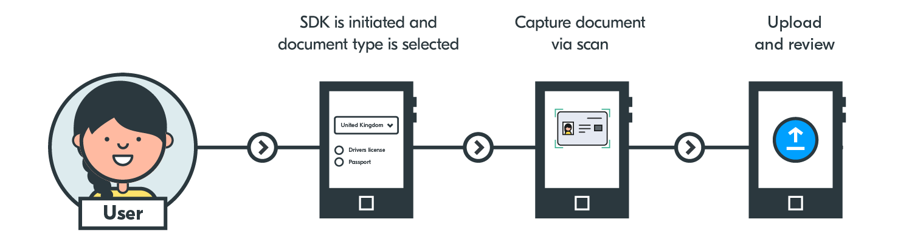

# Yoti Doc Scan iOS SDK



The Yoti Doc Scan iOS SDK allows a user of your app to take a photo of their ID, we then verify this instantly and prepare a response, which your system can then retrieve on your hosted site.

## Prerequisites
In order to integrate with the iOS SDK of Yoti Doc Scan, a working infrastructure is needed.
Please see [developers.yoti.com](https://developers.yoti.com/yoti-doc-scan/yoti-doc-scan-integration-introduction) for more details.

## Requirements
- iOS 10+
- Swift 5+

## Installation

### Carthage
Make sure you are running the latest version of [Carthage](https://github.com/carthage/carthage) by running:
```bash
brew update
brew upgrade carthage
```

Create a [Cartfile](https://github.com/Carthage/Carthage/blob/master/Documentation/Artifacts.md#cartfile) in the same directory where your `.xcodeproj` or `.xcworkspace` is and add the following line to it:
```bash
github "getyoti/yoti-doc-scan-ios" == 1.0.0
github "getyoti/yoti-doc-capture-ios" == 1.5.0
github "BlinkID/blinkid-ios" == 4.7.0
```

Run `carthage update`.

**Note:** This will fetch dependencies into a `Carthage/Checkouts` folder, then copy `YotiDocScan.framework` and `ScanDocument.framework` into a `Carthage/Build/iOS` folder. Please find `Microblink.framework` and `Microblink.bundle` in the `Carthage/Checkouts/blinkid-ios` folder.


On your application targets' `Build Phases` tab:
- Click `+` icon and choose `New Run Script Phase`.
- Create a script with a shell of your choice (e.g. `/bin/sh`).
- Add the following to the script area below the shell:
```bash
/usr/local/bin/carthage copy-frameworks
```

- Add the paths to the frameworks you want to use under `Input Files`, for example:
```bash
$(SRCROOT)/Carthage/Build/iOS/YotiDocScan.framework
$(SRCROOT)/Carthage/Build/iOS/ScanDocument.framework
```

- Then add the paths to the copied frameworks under `Output Files`, for example:
```bash
$(BUILT_PRODUCTS_DIR)/$(FRAMEWORKS_FOLDER_PATH)/YotiDocScan.framework
$(BUILT_PRODUCTS_DIR)/$(FRAMEWORKS_FOLDER_PATH)/ScanDocument.framework
```

### Add Libraries and Resources
Add the following libraries at `Build Phases` → `Link Binary With Libraries`
- `Microblink.framework`
- `libc++.tbd`
- `libiconv.tbd`
- `libz.tbd`

And the following resources at `Build Phases` → `Copy Bundle Resources`
- `Microblink.bundle`

## Integration

### 1. Launching the SDK
Perform the following actions to initialize and present the SDK.
```swift
// Create an instance of our navigation controller.
let navigationController = YotiDocScanNavigationController()

// To specify the `sessionID` and `clientSessionToken`.
navigationController.yotiDocScanDataSource = self

// To perform UI customizations and to handle the verification result.
navigationController.yotiDocScanDelegate = self

// Present the navigation controller.
present(navigationController, animated: true, completion: nil)
```

### 2. Specifying the Session ID and Client Session Token
Conform to `YotiDocScanDataSource`.
```swift
// Configuring the Session ID is required.
func sessionID(for navigationController: YotiDocScanNavigationController) -> String {
    return "Please insert the [Session ID] here"
}

// Configuring the Client Session Token is required.
func clientSessionToken(for navigationController: YotiDocScanNavigationController) -> String {
    return "Please insert the [Client Session Token] here"
}
```

### 3. UI customizations and handling the verification result
Conform to `YotiDocScanDelegate`.
```swift
// Configuring the primary color is optional.
func primaryColor(for navigationController: YotiDocScanNavigationController) -> UIColor {
    return .blue
}

// Handle the result of the verification process.
func yotiDocScan(
    _ navigationController: YotiDocScanNavigationController,
    didFinishWithResult result: YotiDocScanResult) {

    // Dismiss the SDK.
    dismiss(animated: true)

    // Handle the result from the SDK.
    switch result {
    case .success:
        return
    case .failure(let error):
        print(error)
    }
}
```

## Error Handling
Please refer to the following table for a description of error codes that may be returned to you as part of a failed verification.

Code | Description
:-- | :--
1000 | No error occurred. The user cancelled the session for an unknown reason
2000 | Unauthorised request (wrong or expired session token)
2001 | Session not found
2002 | Session expired
2003 | SDK launched without session Token
2004 | SDK launched without session ID
3000 | Yoti's services are down or unable to process the request
3001 | An error occurred during a network request
3002 | User has no network
4000 | The user did not grant permission to the camera
5000 | No camera. The user's camera was not found and file upload is not allowed
6000 | SDK is out-of-date. Please update the SDK to the latest version
6001 | Unexpected internal error
6002 | Unexpected document scanning error

## Support
If you have any other questions please do not hesitate to contact sdksupport@yoti.com.
Once we have answered your question we may contact you again to discuss Yoti products and services. If you'd prefer us not to do this, please let us know when you e-mail.

## License
Please find the licence for the Yoti Doc Scan iOS SDK [here](https//www.yoti.com/wp-content/uploads/2019/08/Yoti-Doc-Scan-SDK-Terms.pdf).
